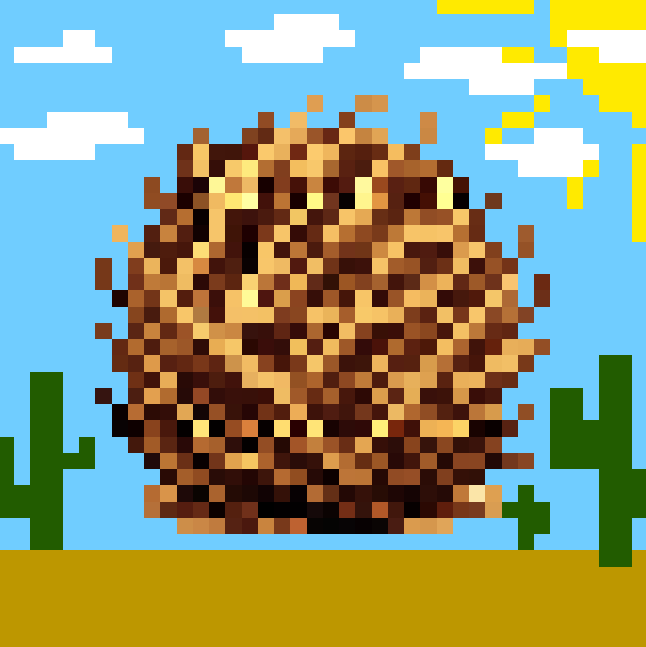

<h1 align = "center">Rodaje Rodante<h1/>

  

<h1 align="center"> Indice </h1>

- ### Descripción

- ### Características

- ### Controles  

- ### Known Issues

- ### Desarrolladores

<h2 align="center"> Descripción </h2>

El juego consiste en controlar a un director de cine en un set de producción en el que se está grabando una escena. En dicha escena, una **planta rodadora** avanza constantemente desde la izquierda del set hasta la derecha. El jugador deberá controlar al director de manera que no se le vea en la **cámara** de rodaje mientras echa a los empleados (extras) que tiene contratados a sueldo mínimo, revelándose. Además, también deberá **arreglar elementos** del set para evitar un fracaso cinematográfico.

¡Repara y echa todo lo altere el rodaje antes de que sea grabado!

<h2 align="center"> Características </h2>

- Control con teclado o mando

- Side-Scroller

- Plataformas 

- Run & Gun

<h2 align="center"> Controles </h2>

## Teclado

- Movimiento : A/D para moverte lateralmente
- Salto : SPACE
- Arreglar / QTE: K
- Disparar: J
- Recargar: I

### QTE's

Que controles se usan en cada QTE:

- QTE Flechas: Fechas 
- QTE Manivela: Ratón
- QTE Spam: SPACE
- QTE Timing: SPACE

## Mando

- Movimiento : Joystick izq / Dpad
- Salto : A
- Arreglar / QTE: X
- Disparar: RT
- Recargar:  Y

### QTE's

Que controles se usan en cada QTE:

- QTE Flechas: Dpad
- QTE Manivela: Joystick dcho
- QTE Spam: A
- QTE Timing: A

<h2 align="center"> Known Issues </h2>

- Huelga de extras se queda saltando cuando se chocan con un techo

<h2 align="center"> Desarrolladores </h2>

- Alejandro Garcia Diaz
- Gabriel Adrian Oltean
- Marcos Tedín Cueto
- Sergio Higuera Gil
- Víctor Román Román
- Tristán Sánchez López

